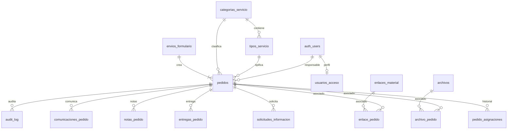

# 05 — Modelo de datos Supabase

**Revisión documental:** 3.0 · 2026-09-11  
**Estado de implementación:** NO VERIFICADO; esta revisión documenta decisiones aprobadas, no ejecuta desarrollo.  
**Autoridad:** decisiones funcionales aprobadas por el propietario el 2026-09-11, ADR vigentes y requisitos de esta revisión.  
**Arquitectura:** `PEDIDOS-WSN-GD-v2` — WordPress.org + Supabase + n8n + Google Drive, con Supabase como fuente de verdad de negocio.  
**Repositorio oficial del desarrollo:** `https://github.com/drivegobtdf/formulariomedios`  
**Repositorio fuente de auditoría WeWeb:** `https://github.com/saldiviapablo/formulariopedidos`  
**Sustituye:** revisión documental 2.0 del 2026-09-11.  

## 1. Principios

- PostgreSQL es fuente de verdad.
- `envios_formulario` agrupa una presentación pública.
- `pedidos` es la unidad operativa; un PED = una pieza/servicio.
- No usar `servicios_solicitados` para nuevos datos v3.
- Secuencia global anual.
- JSONB solo para campos específicos validados por contrato/version.
- Archivos físicos fuera de PostgreSQL, en Google Drive.
- Relaciones de archivo N:M para compartir un único binario entre PED hermanos.
- Toda evolución mediante migrations.

## 2. ERD conceptual

## 3. `categorias_servicio`

| Campo | Tipo | Regla |
|---|---|---|
| id | uuid | PK |
| slug | text | UNIQUE |
| codigo_ped | char(1) | UNIQUE |
| nombre | text | NOT NULL |
| activo | boolean | default true |
| orden | integer | |

Seeds:
- `diseno_grafico` / D
- `cobertura_eventos` / C
- `gacetilla` / G
- `redes_sociales` / R
- `produccion_audiovisual` / P
- `motion_graphics` / M
- `streaming` / S
- `sitios_web` / W

## 4. `tipos_servicio`

Diseño:
- flyer_rrss;
- invitacion_digital;
- certificado;
- otros_diseno.

Resto:
- cobertura_eventos;
- gacetilla;
- redes_sociales;
- produccion_audiovisual;
- motion_graphics;
- streaming;
- sitios_web.

Las variantes internas de las nuevas categorías viven en `informacion_especifica` conforme al schema versionado, salvo futura normalización explícita.

## 5. `envios_formulario`

| Campo | Tipo | Regla |
|---|---|---|
| id | uuid | PK |
| submission_key | uuid | UNIQUE NOT NULL |
| request_fingerprint | text | NOT NULL |
| nombre_apellido | text | NOT NULL |
| telefono | text | NOT NULL |
| correo | text | NOT NULL |
| area_solicitante | text | NOT NULL |
| form_schema_version | integer | NOT NULL |
| created_at | timestamptz | default now() |

La clave/fingerprint gobierna la idempotencia de todo el conjunto.

## 6. `pedido_sequences`

| Campo | Tipo |
|---|---|
| anio | integer PK |
| current_value | bigint >= 0 |
| updated_at | timestamptz |

Reserva atómica global por año. El código de categoría no participa en la secuencia.

## 7. `pedidos`

| Campo | Tipo | Regla |
|---|---|---|
| id | uuid | PK |
| envio_id | uuid | FK envios_formulario NOT NULL |
| pedido_visible | text | UNIQUE NOT NULL |
| anio | integer | NOT NULL |
| numero | bigint | NOT NULL |
| categoria_id | uuid | FK NOT NULL |
| tipo_servicio_id | uuid | FK NOT NULL |
| codigo_categoria | char(1) | NOT NULL, snapshot contractual |
| estado | text | CHECK |
| responsable_user_id | uuid | FK auth.users nullable |
| informacion_especifica | jsonb | objeto validado |
| form_schema_version | integer | NOT NULL |
| fecha_limite | date | nullable, solo cuando el contrato la define |
| version | bigint | optimistic concurrency |
| tracking_token_version | bigint | NOT NULL |
| tracking_token_hash | text | UNIQUE NOT NULL |
| tracking_token_created_at | timestamptz | NOT NULL |
| cancelado_at | timestamptz | nullable |
| finalizado_at | timestamptz | nullable |
| archivado_at | timestamptz | nullable |
| archivado_por | uuid | nullable FK auth.users |
| created_at | timestamptz | |
| updated_at | timestamptz | |

Estados: Nuevo, En revisión, En proceso, Esperando información, Finalizado, Cancelado.

Unique adicional `(anio, numero)`.

## 8. `pedido_asignaciones`

| Campo | Tipo |
|---|---|
| id | uuid PK |
| pedido_id | uuid FK |
| responsable_anterior | uuid nullable |
| responsable_nuevo | uuid FK |
| asignado_por | uuid FK |
| motivo | text nullable |
| created_at | timestamptz |

No reemplaza `audit_log`; facilita consultas operativas.

## 9. `usuarios_acceso`

| Campo | Tipo |
|---|---|
| user_id | uuid PK/FK auth.users |
| nombre | text |
| apellido | text |
| nombre_usuario | text UNIQUE |
| estado_acceso | text CHECK |
| app_role | text CHECK |
| solicitado_at | timestamptz |
| aprobado_at | timestamptz nullable |
| aprobado_por | uuid nullable |
| rechazado_at | timestamptz nullable |
| rechazado_por | uuid nullable |
| revocado_at | timestamptz nullable |
| revocado_por | uuid nullable |
| motivo_revocacion | text nullable |
| updated_at | timestamptz |

Estados: pendiente, aprobado, rechazado, revocado.  
Roles: administrador, equipo, observador.

`nombre_usuario`: lowercase, trim, regex `^[a-z0-9._-]{2,30}$`.

## 10. `solicitudes_informacion`

- id uuid PK;
- pedido_id uuid FK;
- solicitada_por uuid;
- mensaje;
- token_hash UNIQUE;
- estado;
- expires_at;
- respuesta_texto;
- responded_at;
- created_at.

No necesita `servicio_id` en v3.

## 11. `archivos`

Metadata del binario Drive:

| Campo | Tipo |
|---|---|
| id | uuid PK |
| provider | text CHECK = google_drive |
| drive_file_id | text UNIQUE |
| drive_parent_id | text nullable |
| nombre_original | text |
| mime_type | text |
| size_bytes | bigint |
| sha256 | text nullable |
| contexto | text CHECK |
| estado | text CHECK |
| uploaded_by_user_id | uuid nullable |
| created_at | timestamptz |

Contextos: `solicitud`, `informacion_respuesta`, `interno`, `entrega`.  
Estados: `reserved`, `uploaded`, `verified`, `orphaned`, `deleted` según implementación aprobada.

## 12. `archivo_pedido`

PK compuesta `(archivo_id, pedido_id)`. Permite que un único `drive_file_id` se relacione con varios PED sin duplicar binario.

## 13. `upload_reservations`

- id;
- envio_id;
- archivo_id;
- expected_name;
- expected_size;
- expected_mime;
- drive_session_reference cifrada/temporal si corresponde;
- expires_at;
- completed_at;
- state.

Nunca persistir access/refresh tokens en esta tabla.

## 14. `enlaces_material`

- id uuid;
- envio_id;
- url;
- descripcion nullable;
- created_at.

`enlace_pedido` N:M asocia uno o más PED. Validar esquema HTTPS y longitud; no realizar fetch server-side automático de URLs no confiables.

## 15. `notas_pedido`

- id;
- pedido_id;
- autor_user_id;
- visibilidad: `interna` o `solicitante`;
- texto;
- created_at.

Las notas internas no llegan al DTO público.

## 16. `entregas_pedido`

- id;
- pedido_id;
- version;
- nota_publica nullable;
- url_entrega nullable;
- created_by;
- created_at;
- is_current.

Los archivos de entrega se asocian mediante relación específica o referencia de archivo. Debe existir archivo o URL. Una nueva entrega no borra la anterior.

## 17. `comunicaciones_pedido`

Una fila por entrega a destinatario/canal:
- delivery_id;
- event_id;
- pedido_id nullable para `submission.created`;
- envio_id nullable/obligatorio según evento;
- tipo;
- destinatario_canonico;
- template_version;
- estado;
- attempts;
- provider_message_id;
- claim_id/lease;
- idempotency key;
- timestamps.

## 18. `domain_events`

Eventos durables:
- `submission.created`;
- `pedido.state_changed`;
- `pedido.info_requested`;
- `pedido.info_responded`;
- `pedido.finalized`;
- `pedido.cancelled`;
- `pedido.assigned`;
- `pedido.archived`;
- `pedido.restored`;
- `tracking.recovery_requested`;
- `access.requested`.

## 19. `audit_log`

Append-only lógico:
- actor;
- action;
- entity;
- pedido_id/envio_id;
- old_values/new_values sanitizados;
- request_id;
- created_at.

Nunca passwords, tokens raw, OAuth credentials ni cuerpos completos sensibles.

## 20. Idempotencia y concurrencia

- `submission_key` único en envío;
- `request_fingerprint` detecta uso conflictivo;
- creación N PED en transacción;
- secuencia bloqueada/atómica;
- `version` para mutaciones;
- assignment/state/finalize/archive con precondiciones server-side.

## 21. Migración

No crear `servicios_solicitados` para datos v3. Si existen datos históricos de revisión 2.0, su transformación queda en `OPEN-013`; no ejecutar flatten destructivo sin plan de identidad y seguimiento.
