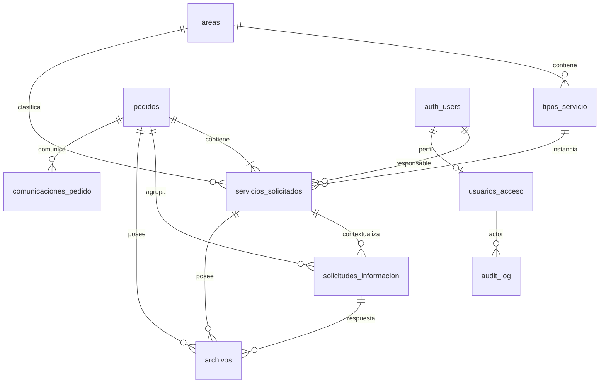

# 05 — Modelo de datos Supabase

**Revisión documental:** 2.0 · 2026-09-11  
**Estado de implementación:** NO VERIFICADO; esta revisión no ejecuta desarrollo.  
**Autoridad:** ADR/requisitos aprobados y registro de pendientes del documento 17.  
**Evidencia:** el baseline receptor es DOCUMENTADO por informe previo; los resultados de QA son planificados salvo evidencia explícita.

**Repositorio oficial del desarrollo:** `https://github.com/drivegobtdf/formulariomedios`  
**Repositorio fuente de auditoría WeWeb:** `https://github.com/saldiviapablo/formulariopedidos`  
**Arquitectura:** `PEDIDOS-WSN-SC-v1`

**Motor:** PostgreSQL  
**Modelo:** `pedido → 1..N servicios_solicitados`

## 1. Principios
Las migrations, seeds, Edge Functions y tests de Supabase deben versionarse en `https://github.com/drivegobtdf/formulariomedios` dentro de la estructura `supabase/`.

- `pedidos` es la cabecera de la solicitud.
- No crear una entidad adicional `solicitudes`.
- El número PED vive únicamente en `pedidos`.
- Estado/responsable operativos viven por servicio.
- JSONB se usa para campos específicos de cada tipo, con validación server-side.
- Se elimina redundancia que pueda derivarse de relaciones normalizadas.
- Toda evolución se versiona mediante migrations.

## 2. ERD

## 3. `areas`
| Campo | Tipo | Regla |
|---|---|---|
| `id` | uuid | PK |
| `slug` | text | UNIQUE NOT NULL |
| `nombre` | text | NOT NULL |
| `activo` | boolean | default true |
| `orden` | integer | default 0 |
| `created_at` | timestamptz | default now() |
| `updated_at` | timestamptz | default now() |

Seed inicial: `diseno_grafico`, `cobertura_eventos`, `gacetilla`, `redes_sociales`.

## 4. `tipos_servicio`
| Campo | Tipo | Regla |
|---|---|---|
| `id` | uuid | PK |
| `area_id` | uuid | FK areas |
| `slug` | text | UNIQUE NOT NULL |
| `nombre` | text | NOT NULL |
| `activo` | boolean | default true |
| `orden` | integer | default 0 |
| timestamps | timestamptz | |

Seed: `flyer_rrss`, `invitacion_digital`, `certificado`, `otros_diseno`, `cobertura_eventos`, `gacetilla`, `redes_sociales`.

## 5. `pedidos`
| Campo | Tipo | Regla |
|---|---|---|
| `id` | uuid | PK |
| `pedido_visible` | text | UNIQUE NOT NULL |
| `anio` | integer | NOT NULL |
| `numero` | bigint | NOT NULL |
| `estado_general` | text | CHECK |
| `nombre_apellido` | text | NOT NULL |
| `telefono` | text | NOT NULL |
| `correo` | text | NOT NULL |
| `area_solicitante` | text | NOT NULL |
| `submission_key` | uuid | UNIQUE NOT NULL |
| `request_fingerprint` | text | NOT NULL; digest canónico del contenido de creación |
| `tracking_token_version` | bigint | NOT NULL; creciente en rotación |
| `tracking_token_hash` | text | UNIQUE NOT NULL |
| `tracking_token_created_at` | timestamptz | NOT NULL |
| `closed_at` | timestamptz | nullable |
| `created_at` | timestamptz | default now() |
| `updated_at` | timestamptz | default now() |

Estados: `Nuevo`, `En proceso`, `Finalizado`, `Cancelado`.  
Unique adicional: `(anio, numero)`.

No conservar `tipos_pedido` JSONB si puede derivarse de `servicios_solicitados`. Columnas Notion quedan fuera del core salvo `OPEN-002`.

## 6. `pedido_sequences`
| Campo | Tipo | Regla |
|---|---|---|
| `anio` | integer | PK |
| `current_value` | bigint | >=0 |
| `updated_at` | timestamptz | |

Reserva atómica con `INSERT ... ON CONFLICT ... DO UPDATE ... RETURNING`.

## 7. `servicios_solicitados`
| Campo | Tipo | Regla |
|---|---|---|
| `id` | uuid | PK |
| `pedido_id` | uuid | FK pedidos NOT NULL |
| `area_id` | uuid | FK areas NOT NULL |
| `tipo_servicio_id` | uuid | FK tipos_servicio NOT NULL |
| `estado` | text | CHECK default Nuevo |
| `responsable_user_id` | uuid | FK auth.users nullable |
| `informacion_especifica` | jsonb | NOT NULL; objeto validado por contrato de tipo/versión |
| `form_schema_version` | integer | NOT NULL; versión del contrato del tipo |
| `client_service_ref` | uuid | NOT NULL; UNIQUE por pedido |
| `version` | bigint | NOT NULL; control de concurrencia |
| `observaciones_internas` | text | nullable |
| `motivo_cancelacion` | text | nullable |
| `producto_final_url` | text | nullable |
| `producto_final_nota` | text | nullable |
| `finalizado_at` | timestamptz | nullable |
| timestamps | timestamptz | |

Estados: Nuevo, En revisión, Asignado, En proceso, Esperando información, Correcciones, Finalizado, Cancelado.

Índices:
- `pedido_id`;
- `(estado, created_at)`;
- `(responsable_user_id, estado)`;
- `(area_id, estado)`.

## 8. `usuarios_acceso`
| Campo | Tipo | Regla |
|---|---|---|
| `user_id` | uuid | PK/FK auth.users |
| `nombre` | text | NOT NULL |
| `apellido` | text | NOT NULL |
| `nombre_usuario` | text | UNIQUE NOT NULL |
| `estado_acceso` | text | CHECK |
| `app_role` | text | CHECK |
| `solicitado_at` | timestamptz | default now() |
| `aprobado_at` | timestamptz | nullable |
| `aprobado_por` | uuid | FK auth.users nullable |
| `revocado_at` | timestamptz | nullable |
| `updated_at` | timestamptz | |

Estados: `pendiente`, `aprobado`, `revocado`. Roles: `equipo_interno`, `admin`.

Username: lowercase, trim, regex `^[a-z0-9._-]{2,30}$`.

## 9. `solicitudes_informacion`
| Campo | Tipo |
|---|---|
| `id` | uuid PK |
| `pedido_id` | uuid FK |
| `servicio_id` | uuid FK |
| `solicitada_por` | uuid FK auth.users |
| `mensaje` | text |
| `token_hash` | text UNIQUE |
| `estado` | text CHECK |
| `expires_at` | timestamptz |
| `respuesta_texto` | text nullable |
| `responded_at` | timestamptz nullable |
| `created_at` | timestamptz |

Estados: pendiente, respondida, vencida. Crear una solicitud NO modifica estados del pedido/servicio.

## 10. `archivos`
| Campo | Tipo |
|---|---|
| `id` | uuid PK |
| `pedido_id` | uuid FK |
| `servicio_id` | uuid nullable FK |
| `solicitud_informacion_id` | uuid nullable FK |
| `bucket` | text |
| `object_path` | text UNIQUE |
| `nombre_original` | text |
| `mime_type` | text |
| `size_bytes` | bigint |
| `contexto` | text CHECK |
| `uploaded_by_user_id` | uuid nullable |
| `created_at` | timestamptz |

Contextos: `solicitud`, `informacion_respuesta`, `interno`, `entrega`.

## 11. `comunicaciones_pedido`
Cada fila representa una entrega a un destinatario/canal: `id` (delivery_id), `event_id` FK al evento, `pedido_id`, `servicio_id`, `tipo`, `canal`, `destinatario`, `destinatario_canonico`, `template_version`, `asunto`, `estado`, `attempts`, `provider_message_id`, `last_error_code`, `sent_at`, `created_at`, `claim_id`, `lease_until`, `provider_idempotency_key`, `first_attempt_at`. UNIQUE `(event_id, canal, destinatario_canonico)`. El mismo evento puede producir varias entregas; event_id ya no es UNIQUE en esta tabla.

Estados: `pending`, `processing`, `sent`, `retry_wait`, `uncertain`, `failed`, `cancelled`. `sent` significa aceptado por proveedor; delivered/bounced son evidencia adicional cuando existe callback fiable.

## 12. `audit_log`
Append-only lógico:
`id bigint identity`, `created_at`, `actor_user_id`, `actor_type`, `action`, `entity_type`, `entity_id`, `pedido_id`, `old_values jsonb`, `new_values jsonb`, `request_id`.

Nunca guardar passwords, raw tokens o headers secretos.

## 13. Idempotencia
submission_key identifica una creación, no autoriza seguimiento. Asociarla a una sesión de presentación y a request_fingerprint del contenido canónico normalizado: solicitante, servicios con client_service_ref, versión de contratos y reservas de archivos. Excluir tokens, request_id y tiempos de transporte del fingerprint. Misma clave/contenido → mismo PED; distinta carga → IDEMPOTENCY_CONFLICT sin mutar.

La operación debe serializar peticiones de la misma clave o manejar su conflicto único y reconsultar bajo visibilidad válida; no confiar en un SELECT previo seguido de INSERT. El incremento de secuencia y resto de inserts están en la misma transacción. La política de año/zona horaria y desborde de seis dígitos se cierra antes de generar numeración productiva (OPEN-005).

operaciones_idempotentes: ámbito, actor/contexto validado, operation_key, request_fingerprint, referencia al resultado y timestamps; clave compuesta única. Sin tokens raw ni PII innecesaria en el resultado. Aplicar a mutaciones que pueden repetirse por timeout. Las ediciones de servicio validan expected_version y aumentan version en el mismo commit.

## 14. Tokens y persistencia
Tokens con al menos 256 bits de aleatoriedad criptográfica; almacenar SHA-256 para validación. El raw solo se entrega a sus destinatarios autorizados y no se registra. ADR-028 se amplía expresamente: se permite un sobre temporal cifrado separado para entrega asíncrona, sin guardar texto plano.

private.token_deliveries: token_id, propósito, entidad/contexto, hash de validación asociado, ciphertext, nonce, key_version, AAD/contexto, created_at, expires_at, estado. Acceso solo de funciones controladas server-side; nunca Data API pública, SELECT de equipo, auditoría old/new ni backup de logs en claro. AAD vincula entorno, token_id, propósito y entidad. La clave de cifrado está fuera de DB en Secrets del backend.

private.tracking_recoveries: id, pedido_id, token_hash UNIQUE, expires_at, estado (pending/consumed/expired/cancelled), created_at, consumed_at. Solicitar recuperación no rota el tracking vigente. Canjear mediante acción explícita valida y consume atómicamente, rota tracking, aumenta versión y cancela otras recuperaciones pendientes. Se puede conservar el mismo intento pendiente dentro del cooldown para evitar tormentas de emails. No rotar de nuevo por reentrega de un evento.

La duración de tracking, recuperación, sobres y cooldown debe constar en configuración versionada y QA; ver OPEN-012. La vigencia ya aprobada de solicitudes de información sigue siendo 15 días.

## 15. Estado general
No crear trigger definitivo para casos terminales mixtos hasta resolver `OPEN-001`.

## Repositorios y procedencia

**Repositorio oficial del desarrollo:** `https://github.com/drivegobtdf/formulariomedios`  
**Arquitectura:** `PEDIDOS-WSN-SC-v1`

**Repositorio fuente de la auditoría WeWeb:** `https://github.com/saldiviapablo/formulariopedidos`  
**Branch de auditoría:** `audit/current-weweb-2026-09-10`  
**Commit QA de referencia:** `0efb624`

El repositorio oficial del desarrollo es el único destino previsto para el código nuevo, documentación de implementación, plugin WordPress, migraciones Supabase, pruebas y workflows versionados. El repositorio de auditoría se conserva como evidencia del sistema WeWeb original y no debe confundirse con el repositorio de implementación.

## Documentación técnica oficial

- WordPress Developer Resources: `https://developer.wordpress.org/`
- Supabase Docs: `https://supabase.com/docs/`

La documentación histórica anterior a la auditoría se utiliza solo como referencia cuando no contradice la evidencia current-state.

## 16. Sesiones y reservas de carga
private.submission_sessions: id UUID, submission_key UNIQUE, capability_hash, created_at, expires_at, estado (open/committing/committed/expired), pedido_id nullable. La capacidad aleatoria no es un token de tracking y no da acceso a pedidos anteriores.

private.upload_reservations: id UUID, session_id o contexto autorizado de información/usuario interno, client_service_ref nullable, contexto, bucket, object_path UNIQUE, expected_size, expected_mime, detected_mime, verified_size, estado (reserved/uploaded/verified/attached/expired/rejected), autorización hasta, ventana máxima de upload, created_at, verified_at, attached_at. Persistir vínculo final a archivo sin permitir consumo en otra presentación.

La limpieza consulta estado, plazos y ausencia de asociación bajo coordinación transaccional; no deduce autorización solo por prefijo incoming. Los objetos asociados pueden conservar su path técnico; el prefijo no determina si son huérfanos.

## 17. Eventos e integridad
private.domain_events: event_id PK, type, aggregate_id, aggregate_version, schema_version, occurred_at, request_id. Eventos no se exponen al público. Ledger de entregas asociado por FK; mensajes Queue llevan identificadores, no contenido sensible. private.communication_attempts: intento, delivery_id, claim_id, estado, timestamps, resultado resumido y referencia proveedor; sin token/cuerpo del email.

Invariantes obligatorias en constraints o procedimientos controlados, indicando dónde se comprueba cada una:
- tipo_servicio pertenece al area_id declarado; usar relación compuesta válida o derivar área de tipo para evitar divergencia.
- solicitud_informacion.servicio_id pertenece a pedido_id; servicio requerido para solicitudes por servicio.
- archivo con servicio o solicitud_info coincide con el mismo pedido y contexto; no autorizar enlaces entre pedidos.
- todo PED conserva >=1 servicio al commit y durante operaciones posteriores; no exponer borrado genérico del último servicio.
- strings requeridos no vacíos después de normalizar; tamaños no negativos, enum/checks, NOT NULL y fechas coherentes.
- Cancelado requiere motivo; Finalizado requiere entrega válida/finalizado_at; regla de reapertura pendiente OPEN-001.
- actor/responsable referencian Auth y el perfil de aprobación se valida por separado. Mantener UUID históricos al revocar; prohibir borrado físico de identidades referenciadas hasta definir política, sin cascada sobre negocio/auditoría.
- cambios de rol, asignación y revocación se serializan coherentemente; un responsable debe estar aprobado al asignar. El tratamiento posterior de servicios de un revocado se define en OPEN-006.
- índices sobre FKs de consulta frecuente y filtros reales; optimizar con planes medidos, no crear índices de cada columna por defecto.

La retención sigue OPEN-003. No eliminar datos históricos para resolver conflictos o reducir almacenamiento sin política aprobada.
