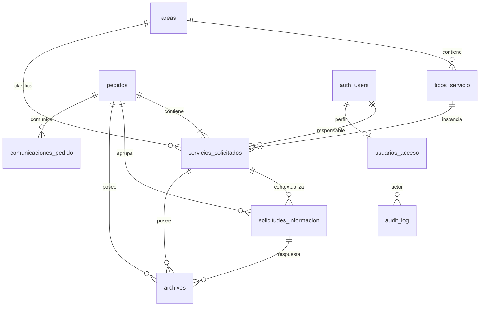

# PEDIDOS — Supabase, datos, permisos y archivos

**Revisión 2.0 — 2026-09-11.** Sustituye el consolidado anterior del mismo tema.

Documento completo de consulta; los originales revisados se encuentran en DOCUMENTOS_CANONICOS del paquete. No implica implementación ni aprobación de reglas pendientes.

## Documentos incluidos

- `05_MODELO_DATOS_SUPABASE.md`
- `06_AUTENTICACION_RBAC_RLS.md`
- `07_RPC_EDGE_FUNCTIONS.md`
- `08_STORAGE_ARCHIVOS.md`

---

# DOCUMENTO: 05_MODELO_DATOS_SUPABASE.md

# 05 — Modelo de datos Supabase

**Revisión documental:** 2.0 · 2026-09-11  
**Estado de implementación:** NO VERIFICADO; esta revisión no ejecuta desarrollo.  
**Autoridad:** ADR/requisitos aprobados y registro de pendientes del documento 17.  
**Evidencia:** el baseline receptor es DOCUMENTADO por informe previo; los resultados de QA son planificados salvo evidencia explícita.

**Repositorio oficial del desarrollo:** `https://github.com/drivegobtdf/formulariomedios`  
**Repositorio fuente de auditoría WeWeb:** `https://github.com/saldiviapablo/formulariopedidos`  
**Arquitectura:** `PEDIDOS-WSN-SC-v1`


**Motor:** PostgreSQL  
**Modelo:** `pedido → 1..N servicios_solicitados`

## 1. Principios
Las migrations, seeds, Edge Functions y tests de Supabase deben versionarse en `https://github.com/drivegobtdf/formulariomedios` dentro de la estructura `supabase/`.

- `pedidos` es la cabecera de la solicitud.
- No crear una entidad adicional `solicitudes`.
- El número PED vive únicamente en `pedidos`.
- Estado/responsable operativos viven por servicio.
- JSONB se usa para campos específicos de cada tipo, con validación server-side.
- Se elimina redundancia que pueda derivarse de relaciones normalizadas.
- Toda evolución se versiona mediante migrations.

## 2. ERD



## 3. `areas`
| Campo | Tipo | Regla |
|---|---|---|
| `id` | uuid | PK |
| `slug` | text | UNIQUE NOT NULL |
| `nombre` | text | NOT NULL |
| `activo` | boolean | default true |
| `orden` | integer | default 0 |
| `created_at` | timestamptz | default now() |
| `updated_at` | timestamptz | default now() |

Seed inicial: `diseno_grafico`, `cobertura_eventos`, `gacetilla`, `redes_sociales`.

## 4. `tipos_servicio`
| Campo | Tipo | Regla |
|---|---|---|
| `id` | uuid | PK |
| `area_id` | uuid | FK areas |
| `slug` | text | UNIQUE NOT NULL |
| `nombre` | text | NOT NULL |
| `activo` | boolean | default true |
| `orden` | integer | default 0 |
| timestamps | timestamptz | |

Seed: `flyer_rrss`, `invitacion_digital`, `certificado`, `otros_diseno`, `cobertura_eventos`, `gacetilla`, `redes_sociales`.

## 5. `pedidos`
| Campo | Tipo | Regla |
|---|---|---|
| `id` | uuid | PK |
| `pedido_visible` | text | UNIQUE NOT NULL |
| `anio` | integer | NOT NULL |
| `numero` | bigint | NOT NULL |
| `estado_general` | text | CHECK |
| `nombre_apellido` | text | NOT NULL |
| `telefono` | text | NOT NULL |
| `correo` | text | NOT NULL |
| `area_solicitante` | text | NOT NULL |
| `submission_key` | uuid | UNIQUE NOT NULL |
| `request_fingerprint` | text | NOT NULL; digest canónico del contenido de creación |
| `tracking_token_version` | bigint | NOT NULL; creciente en rotación |
| `tracking_token_hash` | text | UNIQUE NOT NULL |
| `tracking_token_created_at` | timestamptz | NOT NULL |
| `closed_at` | timestamptz | nullable |
| `created_at` | timestamptz | default now() |
| `updated_at` | timestamptz | default now() |

Estados: `Nuevo`, `En proceso`, `Finalizado`, `Cancelado`.  
Unique adicional: `(anio, numero)`.

No conservar `tipos_pedido` JSONB si puede derivarse de `servicios_solicitados`. Columnas Notion quedan fuera del core salvo `OPEN-002`.

## 6. `pedido_sequences`
| Campo | Tipo | Regla |
|---|---|---|
| `anio` | integer | PK |
| `current_value` | bigint | >=0 |
| `updated_at` | timestamptz | |

Reserva atómica con `INSERT ... ON CONFLICT ... DO UPDATE ... RETURNING`.

## 7. `servicios_solicitados`
| Campo | Tipo | Regla |
|---|---|---|
| `id` | uuid | PK |
| `pedido_id` | uuid | FK pedidos NOT NULL |
| `area_id` | uuid | FK areas NOT NULL |
| `tipo_servicio_id` | uuid | FK tipos_servicio NOT NULL |
| `estado` | text | CHECK default Nuevo |
| `responsable_user_id` | uuid | FK auth.users nullable |
| `informacion_especifica` | jsonb | NOT NULL; objeto validado por contrato de tipo/versión |
| `form_schema_version` | integer | NOT NULL; versión del contrato del tipo |
| `client_service_ref` | uuid | NOT NULL; UNIQUE por pedido |
| `version` | bigint | NOT NULL; control de concurrencia |
| `observaciones_internas` | text | nullable |
| `motivo_cancelacion` | text | nullable |
| `producto_final_url` | text | nullable |
| `producto_final_nota` | text | nullable |
| `finalizado_at` | timestamptz | nullable |
| timestamps | timestamptz | |

Estados: Nuevo, En revisión, Asignado, En proceso, Esperando información, Correcciones, Finalizado, Cancelado.

Índices:
- `pedido_id`;
- `(estado, created_at)`;
- `(responsable_user_id, estado)`;
- `(area_id, estado)`.

## 8. `usuarios_acceso`
| Campo | Tipo | Regla |
|---|---|---|
| `user_id` | uuid | PK/FK auth.users |
| `nombre` | text | NOT NULL |
| `apellido` | text | NOT NULL |
| `nombre_usuario` | text | UNIQUE NOT NULL |
| `estado_acceso` | text | CHECK |
| `app_role` | text | CHECK |
| `solicitado_at` | timestamptz | default now() |
| `aprobado_at` | timestamptz | nullable |
| `aprobado_por` | uuid | FK auth.users nullable |
| `revocado_at` | timestamptz | nullable |
| `updated_at` | timestamptz | |

Estados: `pendiente`, `aprobado`, `revocado`. Roles: `equipo_interno`, `admin`.

Username: lowercase, trim, regex `^[a-z0-9._-]{2,30}$`.

## 9. `solicitudes_informacion`
| Campo | Tipo |
|---|---|
| `id` | uuid PK |
| `pedido_id` | uuid FK |
| `servicio_id` | uuid FK |
| `solicitada_por` | uuid FK auth.users |
| `mensaje` | text |
| `token_hash` | text UNIQUE |
| `estado` | text CHECK |
| `expires_at` | timestamptz |
| `respuesta_texto` | text nullable |
| `responded_at` | timestamptz nullable |
| `created_at` | timestamptz |

Estados: pendiente, respondida, vencida. Crear una solicitud NO modifica estados del pedido/servicio.

## 10. `archivos`
| Campo | Tipo |
|---|---|
| `id` | uuid PK |
| `pedido_id` | uuid FK |
| `servicio_id` | uuid nullable FK |
| `solicitud_informacion_id` | uuid nullable FK |
| `bucket` | text |
| `object_path` | text UNIQUE |
| `nombre_original` | text |
| `mime_type` | text |
| `size_bytes` | bigint |
| `contexto` | text CHECK |
| `uploaded_by_user_id` | uuid nullable |
| `created_at` | timestamptz |

Contextos: `solicitud`, `informacion_respuesta`, `interno`, `entrega`.

## 11. `comunicaciones_pedido`
Cada fila representa una entrega a un destinatario/canal: `id` (delivery_id), `event_id` FK al evento, `pedido_id`, `servicio_id`, `tipo`, `canal`, `destinatario`, `destinatario_canonico`, `template_version`, `asunto`, `estado`, `attempts`, `provider_message_id`, `last_error_code`, `sent_at`, `created_at`, `claim_id`, `lease_until`, `provider_idempotency_key`, `first_attempt_at`. UNIQUE `(event_id, canal, destinatario_canonico)`. El mismo evento puede producir varias entregas; event_id ya no es UNIQUE en esta tabla.

Estados: `pending`, `processing`, `sent`, `retry_wait`, `uncertain`, `failed`, `cancelled`. `sent` significa aceptado por proveedor; delivered/bounced son evidencia adicional cuando existe callback fiable.

## 12. `audit_log`
Append-only lógico:
`id bigint identity`, `created_at`, `actor_user_id`, `actor_type`, `action`, `entity_type`, `entity_id`, `pedido_id`, `old_values jsonb`, `new_values jsonb`, `request_id`.

Nunca guardar passwords, raw tokens o headers secretos.

## 13. Idempotencia
submission_key identifica una creación, no autoriza seguimiento. Asociarla a una sesión de presentación y a request_fingerprint del contenido canónico normalizado: solicitante, servicios con client_service_ref, versión de contratos y reservas de archivos. Excluir tokens, request_id y tiempos de transporte del fingerprint. Misma clave/contenido → mismo PED; distinta carga → IDEMPOTENCY_CONFLICT sin mutar.

La operación debe serializar peticiones de la misma clave o manejar su conflicto único y reconsultar bajo visibilidad válida; no confiar en un SELECT previo seguido de INSERT. El incremento de secuencia y resto de inserts están en la misma transacción. La política de año/zona horaria y desborde de seis dígitos se cierra antes de generar numeración productiva (OPEN-005).

operaciones_idempotentes: ámbito, actor/contexto validado, operation_key, request_fingerprint, referencia al resultado y timestamps; clave compuesta única. Sin tokens raw ni PII innecesaria en el resultado. Aplicar a mutaciones que pueden repetirse por timeout. Las ediciones de servicio validan expected_version y aumentan version en el mismo commit.

## 14. Tokens y persistencia
Tokens con al menos 256 bits de aleatoriedad criptográfica; almacenar SHA-256 para validación. El raw solo se entrega a sus destinatarios autorizados y no se registra. ADR-028 se amplía expresamente: se permite un sobre temporal cifrado separado para entrega asíncrona, sin guardar texto plano.

private.token_deliveries: token_id, propósito, entidad/contexto, hash de validación asociado, ciphertext, nonce, key_version, AAD/contexto, created_at, expires_at, estado. Acceso solo de funciones controladas server-side; nunca Data API pública, SELECT de equipo, auditoría old/new ni backup de logs en claro. AAD vincula entorno, token_id, propósito y entidad. La clave de cifrado está fuera de DB en Secrets del backend.

private.tracking_recoveries: id, pedido_id, token_hash UNIQUE, expires_at, estado (pending/consumed/expired/cancelled), created_at, consumed_at. Solicitar recuperación no rota el tracking vigente. Canjear mediante acción explícita valida y consume atómicamente, rota tracking, aumenta versión y cancela otras recuperaciones pendientes. Se puede conservar el mismo intento pendiente dentro del cooldown para evitar tormentas de emails. No rotar de nuevo por reentrega de un evento.

La duración de tracking, recuperación, sobres y cooldown debe constar en configuración versionada y QA; ver OPEN-012. La vigencia ya aprobada de solicitudes de información sigue siendo 15 días.

## 15. Estado general
No crear trigger definitivo para casos terminales mixtos hasta resolver `OPEN-001`.


## Repositorios y procedencia

**Repositorio oficial del desarrollo:** `https://github.com/drivegobtdf/formulariomedios`  
**Arquitectura:** `PEDIDOS-WSN-SC-v1`

**Repositorio fuente de la auditoría WeWeb:** `https://github.com/saldiviapablo/formulariopedidos`  
**Branch de auditoría:** `audit/current-weweb-2026-09-10`  
**Commit QA de referencia:** `0efb624`

El repositorio oficial del desarrollo es el único destino previsto para el código nuevo, documentación de implementación, plugin WordPress, migraciones Supabase, pruebas y workflows versionados. El repositorio de auditoría se conserva como evidencia del sistema WeWeb original y no debe confundirse con el repositorio de implementación.

## Documentación técnica oficial

- WordPress Developer Resources: `https://developer.wordpress.org/`
- Supabase Docs: `https://supabase.com/docs/`

La documentación histórica anterior a la auditoría se utiliza solo como referencia cuando no contradice la evidencia current-state.

## 16. Sesiones y reservas de carga
private.submission_sessions: id UUID, submission_key UNIQUE, capability_hash, created_at, expires_at, estado (open/committing/committed/expired), pedido_id nullable. La capacidad aleatoria no es un token de tracking y no da acceso a pedidos anteriores.

private.upload_reservations: id UUID, session_id o contexto autorizado de información/usuario interno, client_service_ref nullable, contexto, bucket, object_path UNIQUE, expected_size, expected_mime, detected_mime, verified_size, estado (reserved/uploaded/verified/attached/expired/rejected), autorización hasta, ventana máxima de upload, created_at, verified_at, attached_at. Persistir vínculo final a archivo sin permitir consumo en otra presentación.

La limpieza consulta estado, plazos y ausencia de asociación bajo coordinación transaccional; no deduce autorización solo por prefijo incoming. Los objetos asociados pueden conservar su path técnico; el prefijo no determina si son huérfanos.

## 17. Eventos e integridad
private.domain_events: event_id PK, type, aggregate_id, aggregate_version, schema_version, occurred_at, request_id. Eventos no se exponen al público. Ledger de entregas asociado por FK; mensajes Queue llevan identificadores, no contenido sensible. private.communication_attempts: intento, delivery_id, claim_id, estado, timestamps, resultado resumido y referencia proveedor; sin token/cuerpo del email.

Invariantes obligatorias en constraints o procedimientos controlados, indicando dónde se comprueba cada una:
- tipo_servicio pertenece al area_id declarado; usar relación compuesta válida o derivar área de tipo para evitar divergencia.
- solicitud_informacion.servicio_id pertenece a pedido_id; servicio requerido para solicitudes por servicio.
- archivo con servicio o solicitud_info coincide con el mismo pedido y contexto; no autorizar enlaces entre pedidos.
- todo PED conserva >=1 servicio al commit y durante operaciones posteriores; no exponer borrado genérico del último servicio.
- strings requeridos no vacíos después de normalizar; tamaños no negativos, enum/checks, NOT NULL y fechas coherentes.
- Cancelado requiere motivo; Finalizado requiere entrega válida/finalizado_at; regla de reapertura pendiente OPEN-001.
- actor/responsable referencian Auth y el perfil de aprobación se valida por separado. Mantener UUID históricos al revocar; prohibir borrado físico de identidades referenciadas hasta definir política, sin cascada sobre negocio/auditoría.
- cambios de rol, asignación y revocación se serializan coherentemente; un responsable debe estar aprobado al asignar. El tratamiento posterior de servicios de un revocado se define en OPEN-006.
- índices sobre FKs de consulta frecuente y filtros reales; optimizar con planes medidos, no crear índices de cada columna por defecto.

La retención sigue OPEN-003. No eliminar datos históricos para resolver conflictos o reducir almacenamiento sin política aprobada.

# FIN DOCUMENTO: 05_MODELO_DATOS_SUPABASE.md


---

# DOCUMENTO: 06_AUTENTICACION_RBAC_RLS.md

# 06 — Autenticación, RBAC y RLS

**Revisión documental:** 2.0 · 2026-09-11  
**Estado de implementación:** NO VERIFICADO; esta revisión no ejecuta desarrollo.  
**Autoridad:** ADR/requisitos aprobados y registro de pendientes del documento 17.  
**Evidencia:** el baseline receptor es DOCUMENTADO por informe previo; los resultados de QA son planificados salvo evidencia explícita.

**Repositorio oficial del desarrollo:** `https://github.com/drivegobtdf/formulariomedios`  
**Repositorio fuente de auditoría WeWeb:** `https://github.com/saldiviapablo/formulariopedidos`  
**Arquitectura:** `PEDIDOS-WSN-SC-v1`


## 1. Modelo
Supabase Auth autentica al personal interno. El público no crea cuenta.

```text
auth.users
   1
   │
   1
usuarios_acceso
   ├─ estado_acceso
   └─ app_role
```

## 2. Claves API
Usar publishable key en navegador y secret key solo server-side. La publishable key mapea a `anon` sin usuario y `authenticated` con sesión; RLS decide acceso. La secret key es elevada y no se expone.

## 3. Capas de identidad
**Rol técnico:** `anon`, `authenticated`, `service_role`.  
**Rol de aplicación:** `equipo_interno`, `admin`.  
**Estado:** `pendiente`, `aprobado`, `revocado`.

Autenticarse no equivale a ser autorizado.

## 4. Alta
1. `signUp`.
2. Crear `usuarios_acceso` pending.
3. No acceso operativo.
4. Admin aprueba y asigna rol.
5. RLS habilita operaciones desde ese momento.

El cliente nunca elige su rol.

## 5. Matriz
| Recurso | anon | pending/revoked | equipo aprobado | admin |
|---|---:|---:|---:|---:|
| catálogo público mínimo | SELECT | SELECT | SELECT | SELECT |
| pedidos | no | no | SELECT | SELECT |
| servicios | no | no | SELECT | SELECT |
| info interna | no | no | SELECT | SELECT |
| archivos | no directo | no | según permiso | según permiso |
| comunicaciones | no | no | lectura necesaria | lectura |
| usuarios | no | propio mínimo | responsables vía RPC | administrar |
| audit | no | no | limitado/ninguno | lectura |

## 6. Grants + RLS
Por cada tabla expuesta:
1. revocar privilegios innecesarios;
2. conceder solo operaciones requeridas;
3. habilitar RLS;
4. crear policies;
5. test allow/deny.

No dar `INSERT/UPDATE/DELETE` genérico a `anon`.

## 7. Patrón de aprobación
Policy/RPC debe comprobar:
- `auth.uid()`;
- fila `usuarios_acceso`;
- `estado_acceso='aprobado'`;
- rol permitido.

Evitar policies recursivas sobre `usuarios_acceso`.

## 8. SECURITY DEFINER
Solo si es necesario:
- función pequeña;
- `SET search_path=''`;
- schemas explícitos;
- auth/role dentro;
- `REVOKE EXECUTE FROM PUBLIC`;
- grants mínimos;
- sin SQL dinámico proveniente de usuario.

## 9. RPC críticas
Las tablas pueden negar UPDATE directo y exponer RPCs que limitan exactamente qué campos/acciones son válidos.

## 10. Primer administrador
No auto-elevar signup. Crear identidad por canal administrativo, verificarla y elevarla mediante migration/SQL controlada y auditada.

## 11. Sesión frontend
Usar `supabase-js` con refresh/persistencia apropiados. No loguear JWT. Logout explícito.

## 12. Revocación
RLS consulta `estado_acceso`; un JWT aún vigente no debe mantener permisos de negocio después de revocar.

## 13. WordPress
La sesión `wp_users` no autoriza PEDIDOS. WordPress admin y PEDIDOS admin son roles independientes.


## Repositorios y procedencia

**Repositorio oficial del desarrollo:** `https://github.com/drivegobtdf/formulariomedios`  
**Arquitectura:** `PEDIDOS-WSN-SC-v1`

**Repositorio fuente de la auditoría WeWeb:** `https://github.com/saldiviapablo/formulariopedidos`  
**Branch de auditoría:** `audit/current-weweb-2026-09-10`  
**Commit QA de referencia:** `0efb624`

El repositorio oficial del desarrollo es el único destino previsto para el código nuevo, documentación de implementación, plugin WordPress, migraciones Supabase, pruebas y workflows versionados. El repositorio de auditoría se conserva como evidencia del sistema WeWeb original y no debe confundirse con el repositorio de implementación.

## Documentación técnica oficial

- WordPress Developer Resources: `https://developer.wordpress.org/`
- Supabase Docs: `https://supabase.com/docs/`

La documentación histórica anterior a la auditoría se utiliza solo como referencia cuando no contradice la evidencia current-state.

## 14. Matriz de exposición efectiva requerida
| Superficie | Público sin Auth | Auth pendiente/revocado/sin perfil | Equipo aprobado | Admin aprobado | Backend controlado |
|---|---|---|---|---|---|
| Catálogo mínimo activo | Lectura DTO | Lectura DTO | Lectura DTO | Lectura DTO | Mantenimiento controlado |
| Datos PED/servicios | Solo Edge + token válido | Sin lectura operativa por sesión | Lectura operativa mínima | Lectura operativa mínima | Según operación |
| Escrituras operativas genéricas | No | No | No | No | No interfaz arbitraria |
| RPC internas permitidas | No | No | Según operación y matriz funcional | Según operación | Según necesidad |
| Perfiles | No | Propio mínimo | Propio mínimo / responsables DTO | Administración controlada | Alta validada |
| Hashes/sobres/reservas/colas | No | No | No | No SELECT directo | Funciones específicas |
| Storage | Capacidades firmadas/contexto | Sin permiso operativo por sesión | Autorización por archivo | Autorización por archivo | Operación específica |

El acceso con un token público válido es independiente de una sesión interna pendiente: no debe convertirla en autorizada. Un anon o usuario interno no puede saltarse Edge invocando pedidos_create u otras RPC server-only. Revocar EXECUTE de PUBLIC, anon y authenticated en esas RPC y otorgarlo exclusivamente al rol backend requerido. La política por defecto de nuevas funciones también debe quedar restringida. Revisar views, grants de columnas y funciones expuestas: RLS filtra filas, no sustituye minimización de columnas.

## 15. Alta, recuperación y administración
La creación de perfil debe ser coherente con Auth: trigger/control server-side que normaliza y valida metadatos permitidos, fija pendiente y rol no elevado, y rechaza username conflictivo sin permitir perfiles parciales con acceso. No confiar en app_role o estado recibidos en signup. Definir recuperación de alta fallida y probar colisiones concurrentes.

Login por email o username, significado de rechazo, confirmación de correo y gestión del último administrador quedan OPEN-006. Hasta cerrarlo, no implementar una pantalla o RPC que adopte silenciosamente una alternativa. Cualquier identidad no aprobada queda denegada por defecto.

El primer admin se crea por procedimiento administrativo auditado vinculado a su UUID verificado; no poner cuentas reales o credenciales en seeds. Evitar autoaprobación pública. Gestión posterior de roles requiere comprobación de admin aprobado y preservación del último admin según regla pendiente.

Auth callbacks y reset password deben tener URLs allowlisted por entorno. Los emails de autenticación nativos pertenecen al flujo Supabase Auth; ADR-021 se refiere a comunicaciones de negocio PEDIDOS. No reconstruir Auth en n8n. La entrega de correos Auth/SMTP también se valida antes de producción.

## 16. Revocación y alcance
Comprobar aprobación en cada lectura/escritura protegida, incluidas Edge con cliente elevado, descargas, firma de URLs y RPC. No confiar solo en claims viejos del JWT. Una revocación impide emitir nuevos accesos; documentar el tiempo residual de capacidades ya emitidas y no prometer revocar archivos que ya se descargaron. Si negocio exige revocación inmediata de cada descarga, diseñar autorización por solicitud antes de aprobar ese contrato.

El alcance global de lectura de equipo está documentado en la matriz original y se conserva. Permisos de modificación globales/por área/por responsable deben fijarse antes de las RPC operativas. Cualquier segmentación nueva modifica una decisión funcional y no se presupone.

# FIN DOCUMENTO: 06_AUTENTICACION_RBAC_RLS.md


---

# DOCUMENTO: 07_RPC_EDGE_FUNCTIONS.md

# 07 — RPC y Edge Functions

**Revisión documental:** 2.0 · 2026-09-11  
**Estado de implementación:** NO VERIFICADO; esta revisión no ejecuta desarrollo.  
**Autoridad:** ADR/requisitos aprobados y registro de pendientes del documento 17.  
**Evidencia:** el baseline receptor es DOCUMENTADO por informe previo; los resultados de QA son planificados salvo evidencia explícita.

**Repositorio oficial del desarrollo:** `https://github.com/drivegobtdf/formulariomedios`  
**Repositorio fuente de auditoría WeWeb:** `https://github.com/saldiviapablo/formulariopedidos`  
**Arquitectura:** `PEDIDOS-WSN-SC-v1`


## 1. Criterio
- PostgreSQL/RPC: invariantes, transacciones, state machine.
- Edge: frontera pública, tokens, CORS, rate limit, signed uploads, secretos.
- Browser: UI, nunca autorización final.

## 2. Mapeo
| Necesidad | Implementación objetivo |
|---|---|
| crear pedido | Edge `create-pedido` → RPC `pedidos_create` |
| detalle | RPC `pedido_detail_get` |
| responsables | RPC `responsables_list` |
| asignar | RPC `servicio_assign` |
| actualizar servicio | RPC `servicio_update` |
| finalizar | RPC `servicio_finalize` |
| pedir información | Edge `info-request-create` → RPC server-only `info_request_create` |
| validar token info | Edge `info-token-validate` |
| responder info | Edge `info-response-submit` |
| tracking | Edge `tracking-get` |
| recuperación tracking | Edge `tracking-recovery-request` |
| usuarios admin | RPCs admin |
| sesión de presentación | Edge `submission-prepare` |
| upload público | Edge `upload-prepare` / `upload-complete` |
| canje recuperación | Edge `tracking-recovery-exchange` |
| consumo automatización | Edge `automation-next-event` / `automation-ack-event` / renovación/resultado |

## 3. `create-pedido`
Responsabilidades Edge:
- POST;
- CORS allowlist;
- rate limit/anti-abuso;
- límites de body;
- validación estructural;
- normalización;
- llamada RPC;
- DTO público;
- no email directo.

## 4. `pedidos_create`
Invocable solo por Edge. La Edge valida capacidad de presentación, body, contratos, límites y reservas; genera token/hash/sobre cifrado del primer intento sin emitir correo. PostgreSQL revalida lo relevante, serializa por submission_key y confirma en una transacción:
1. validar sesión/contexto, fingerprint y replay;
2. validar catálogo activo y relación tipo/área;
3. validar contrato versionado de cada servicio y mínimo uno;
4. reservar número e insertar pedido;
5. insertar servicios con sus client_service_ref;
6. bloquear/consumir reservas verificadas y asociar archivos;
7. persistir hash y sobre temporal cifrado autorizado;
8. registrar evento, entregas definidas por política y enqueue;
9. auditoría sin raw/ciphertext sensible y marcar sesión committed;
10. devolver DTO con PED y resultado de creación.

Fallo antes del commit → rollback completo de DB. La transferencia previa de archivos puede dejar huérfanos a limpiar. Replay no reemplaza tokens/sobres ni crea eventos. La Edge solo devuelve el raw que corresponde al primer commit efectivo; descarta tokens generados para intentos que terminaron en replay.

## 5. Validadores por servicio
Validación server-side por slug:
`flyer_rrss`, `invitacion_digital`, `certificado`, `otros_diseno`, `cobertura_eventos`, `gacetilla`, `redes_sociales`.

No aceptar JSONB libre sin contrato.

## 6. `servicio_assign`
Valida caller aprobado, alcance autorizado, responsable aprobado, expected_version, existencia y estado. Guarda UUID Auth; cualquier cambio asociado de estado requiere matriz aprobada OPEN-001. Incrementa version y audita atómicamente.

## 7. `servicio_update`
Whitelist de campos. Valida state transition. Cancelación exige motivo.

## 8. `servicio_finalize`
Valida rol, servicio y URL HTTPS; guarda entrega, Finalizado, audit y evento.

## 9. `info_request_create`
La Edge autentica al operador, genera token aleatorio/hash y sobre cifrado. RPC server-only revalida actor/alcance y guarda solicitud con `expires_at = now()+15 días`, estado pendiente, sobre, entrega, Queue y auditoría en un commit. operation_key evita duplicados. **No modifica estado PED/servicio.**

## 10. `info-token-validate`
Recibe token raw, hashea y devuelve solo datos públicos si está pendiente y vigente.

## 11. `info-response-submit`
Valida token, texto/archivos, marca respondida, asocia archivos, crea evento y evita doble respuesta indebida.

## 12. `tracking-get`
Input PED+token. Output solo:
- PED;
- fecha;
- estado general público;
- servicios y estados públicos;
- entregables autorizados.

Excluir observaciones internas, emails del equipo, UUID Auth y audit.

## 13. Recuperación
PED+email siempre recibe respuesta neutra y protección antiabuso. Si coincide, registrar una recuperación temporal y Queue. No rotar el tracking vigente al solicitar. El canje explícito consume la recuperación y rota el acceso de forma atómica; una reentrega no vuelve a rotar.

## 14. Admin
- `admin_users_list`
- `admin_user_approve`
- `admin_user_revoke`
- `admin_username_update`

Todas validan `app_role=admin` server-side.

## 15. Errores HTTP
`400` input; `401` auth; `403` permiso; `404` neutro cuando corresponda; `409` conflicto; `422` negocio; `429` rate limit; `500` interno con `request_id`, sin stacktrace.

## 16. CORS
Origins explícitos local/staging/production. CORS no sustituye Auth/RLS.


## Repositorios y procedencia

**Repositorio oficial del desarrollo:** `https://github.com/drivegobtdf/formulariomedios`  
**Arquitectura:** `PEDIDOS-WSN-SC-v1`

**Repositorio fuente de la auditoría WeWeb:** `https://github.com/saldiviapablo/formulariopedidos`  
**Branch de auditoría:** `audit/current-weweb-2026-09-10`  
**Commit QA de referencia:** `0efb624`

El repositorio oficial del desarrollo es el único destino previsto para el código nuevo, documentación de implementación, plugin WordPress, migraciones Supabase, pruebas y workflows versionados. El repositorio de auditoría se conserva como evidencia del sistema WeWeb original y no debe confundirse con el repositorio de implementación.

## Documentación técnica oficial

- WordPress Developer Resources: `https://developer.wordpress.org/`
- Supabase Docs: `https://supabase.com/docs/`

La documentación histórica anterior a la auditoría se utiliza solo como referencia cuando no contradice la evidencia current-state.

## 17. Matriz de invocación y errores
| Endpoint / RPC | Caller | Autorización final |
|---|---|---|
| submission-prepare | Público, sin Supabase Auth | Límites compartidos/antiabuso; emite capacidad de presentación |
| upload-prepare/complete inicial | Capacidad de presentación | Hash, estado, plazo, cupo y relación con submission_key |
| create-pedido → pedidos_create | Público con capacidad → Edge | RPC solo backend; sesión, fingerprint, reservas y contratos |
| tracking-get / firma archivo público | PED + tracking token | Hash/contexto; DTO mínimo y archivo autorizado |
| tracking-recovery-request | Público | Respuesta neutra; rate limit/cooldown |
| tracking-recovery-exchange | Token recuperación + acción explícita | Consumo y rotación atómicos |
| info-request-create → info_request_create | JWT interno aprobado → Edge | Actor actual, alcance; RPC solo backend |
| info-token-validate / info-response-submit | Token info | Pendiente, plazo, servicio y reservas del contexto |
| pedido_detail_get / responsables_list | JWT interno | auth.uid(), perfil aprobado y alcance |
| servicio_assign/update/finalize | JWT interno | Actor/alcance, versión, operación idempotente y transición aprobada |
| admin_* | JWT admin | Admin aprobado actual y reglas de administración |
| automation-* | Secreto dedicado n8n | Autenticación integración + delivery/claim vigente; RPC solo backend |

Para endpoints internos, validar JWT del usuario, no una publishable key. Para públicos sin sesión y n8n con credencial propia, configurar verificación de plataforma acorde al mecanismo y validar en el handler; no desactivar controles globalmente. La especificación debe comprobarse con la versión actual de Supabase CLI/Edge antes de desplegar. Referencia: https://supabase.com/docs/guides/functions/auth y /auth-headers (consulta 2026-09-11).

En Edge elevada, actor_user_id proviene de JWT verificado, no del body; la RPC vuelve a comprobar su aprobación/rol y autoriza la entidad. RLS no protege automáticamente operaciones hechas con cliente elevado.

## 18. Transiciones, concurrencia y entrega
servicio_update no puede saltarse servicio_finalize mediante estado=Finalizado. Centralizar invariantes compartidas; negar campos fuera de whitelist. expected_version obliga a detectar cambios concurrentes y devolver VERSION_CONFLICT. operation_key/fingerprint reutilizados devuelven mismo resultado; no vuelven a notificar.

No afirmar que una URL HTTPS garantiza permisos del archivo o disponibilidad futura. La entrega se valida contra el contrato aprobado, sin descargar arbitrariamente URLs de usuario desde backend. Para Storage, persistir referencia estable y firmar al consultar, no guardar una signed URL expirable como entrega permanente.

## 19. Seguridad pública
Rate limiting debe compartir estado y límites entre instancias: un contador en memoria Edge no es control suficiente. Puede usarse PostgreSQL con operaciones atómicas y expiración para el volumen esperado, sin introducir un servicio adicional por defecto. Parámetros y dimensionamiento OPEN-011/012. Combinar dimensiones según endpoint y no bloquear indiscriminadamente redes institucionales compartidas. CORS y honeypot son capas auxiliares, no autorización.

## 20. Consistencia de recuperación
La nueva credencial se genera en Edge y su hash/cambio de versión se confirma solo si el canje de recuperación sigue pendiente y válido bajo bloqueo. Al canjear se invalidan las demás recuperaciones pendientes del mismo PED y se cancelan entregas pendientes de enlaces ya inválidos. Una carrera con un correo ya aceptado puede dejar un enlace antiguo en la bandeja del destinatario: deberá rechazarse sin filtrar datos y ofrecer recuperación. No se promete retirar correos ya enviados.

Si un replay confirma canje ya realizado no vuelve a entregar raw por una clave pública ni rota otra vez. El resultado informa acceso emitido y, si el navegador perdió la credencial, permite iniciar recuperación independiente. No usar generation order del consumidor para decidir qué tracking queda activo.

# FIN DOCUMENTO: 07_RPC_EDGE_FUNCTIONS.md


---

# DOCUMENTO: 08_STORAGE_ARCHIVOS.md

# 08 — Storage y archivos

**Revisión documental:** 2.0 · 2026-09-11  
**Estado de implementación:** NO VERIFICADO; esta revisión no ejecuta desarrollo.  
**Autoridad:** ADR/requisitos aprobados y registro de pendientes del documento 17.  
**Evidencia:** el baseline receptor es DOCUMENTADO por informe previo; los resultados de QA son planificados salvo evidencia explícita.

**Repositorio oficial del desarrollo:** `https://github.com/drivegobtdf/formulariomedios`  
**Repositorio fuente de auditoría WeWeb:** `https://github.com/saldiviapablo/formulariopedidos`  
**Arquitectura:** `PEDIDOS-WSN-SC-v1`


## 1. Decisión
Bucket Supabase privado: `pedidos-private`. No `wp-content/uploads`.

## 2. Baseline
- máximo 5 archivos;
- máximo 25 MB;
- PDF, PNG, JPG/JPEG, DOCX, ZIP;
- privados.

25 MB queda por debajo del límite máximo actual de 50 MB por archivo configurable en proyectos Supabase Free.

## 3. Carga pública
1. submission-prepare emite sesión/capacidad de presentación sin crear un PED.
2. upload-prepare valida esa capacidad, contexto y cupo; crea reserva y path aleatorio.
3. Emite autorización firmada; navegador transfiere directamente a Storage.
4. upload-complete verifica objeto, bytes, tipo y estado; marca verified o rejected.
5. create-pedido consume la reserva verificada y la asocia de forma atómica al pedido/servicio.

No dar INSERT genérico a anon. Una ruta de objeto recibida del cliente no demuestra pertenencia. Para solicitudes de información se emite reserva vinculada al token/contexto específico; no se acepta una reserva inicial de otro PED. Las cargas internas requieren usuario aprobado y autorización de contexto.

Para archivos mayores de 6 MB usar TUS reanudable como diseño preferido. Supabase soporta tokens firmados con x-signature en TUS. Probar la librería/versión elegida sin incluir upsert general: las cargas son inmutables y no deben sobrescribir archivos asociados.

Referencia: https://supabase.com/docs/guides/storage/uploads/resumable-uploads (consulta 2026-09-11).

## 4. Paths
```text
incoming/<submission_key>/<file_uuid>/<safe_filename>
```

No incluir PII ni tokens.

## 5. Huérfanos
El plazo inicial genérico de 24 h se sustituye por una política coordinada con la ventana máxima de carga reanudable y las autorizaciones emitidas. Nunca limpiar solo por antigüedad del path. Registrar último vencimiento técnico y margen, sin borrar antes de que expire toda autorización activa.

El job reclama reservas vencidas no asociadas, bloquea nuevas vinculaciones mientras elimina y reintenta de forma segura si falla Storage. Una reserva en committing o attached no se elimina. Un inventario reconcilia objetos sin reserva, reservas sin objeto y metadata sin objeto. No borrar metadata de objetos asociados para ocultar un fallo.

Los plazos concretos se registran en OPEN-012 antes de habilitar la función. La ventana de upload TUS y la de la URL firmada son distintas; probar ambas, no inventar expiraciones soportadas por el proveedor.

## 6. Descarga interna
Sesión aprobada → autorización → signed URL corta (p.ej. 15 minutos).

## 7. Descarga pública
Solo para archivo/entregable autorizado por tracking token; generar signed URL específica y temporal.

## 8. Policies
- bucket no listable públicamente;
- public sin SELECT directo;
- carga pública solo por signed upload emitido por backend;
- personal aprobado con políticas de acceso;
- delete restringido.

## 9. Validación
Dos capas:
1. restricciones bucket;
2. aplicación: extensión, MIME, tamaño y contexto.

No afirmar antivirus si no se implementa; puede añadirse según política institucional.

## 10. Metadata
`archivos`: relaciones, path, nombre original, MIME, bytes, contexto, uploader interno y timestamp.

## 11. Borrado
No habilitar borrado físico de datos históricos hasta aprobar `OPEN-003`. Toda eliminación debe sincronizar autorización, objeto, metadata y auditoría.


## Repositorios y procedencia

**Repositorio oficial del desarrollo:** `https://github.com/drivegobtdf/formulariomedios`  
**Arquitectura:** `PEDIDOS-WSN-SC-v1`

**Repositorio fuente de la auditoría WeWeb:** `https://github.com/saldiviapablo/formulariopedidos`  
**Branch de auditoría:** `audit/current-weweb-2026-09-10`  
**Commit QA de referencia:** `0efb624`

El repositorio oficial del desarrollo es el único destino previsto para el código nuevo, documentación de implementación, plugin WordPress, migraciones Supabase, pruebas y workflows versionados. El repositorio de auditoría se conserva como evidencia del sistema WeWeb original y no debe confundirse con el repositorio de implementación.

## Documentación técnica oficial

- WordPress Developer Resources: `https://developer.wordpress.org/`
- Supabase Docs: `https://supabase.com/docs/`

La documentación histórica anterior a la auditoría se utiliza solo como referencia cuando no contradice la evidencia current-state.

## 12. Verificación y límites por contexto
Cinco archivos por presentación inicial, 25 MB por archivo y formatos PDF/PNG/JPG/JPEG/DOCX/ZIP se conservan. El límite se cuenta sobre reservas activas/objetos vinculables de la sesión y se hace cumplir server-side; no se evade abriendo varias ventanas. Definir bytes exactos de “25 MB” en OPEN-012 y comunicarlos igual en UI/servidor/bucket.

No confiar solo en Content-Type o extensión del cliente. Comparar tamaño almacenado y verificar firma/formato según tipo; DOCX y ZIP necesitan identificación específica sin extracción insegura. Los metadatos declarados y detectados se distinguen. Una discrepancia rechaza el archivo. No se afirma protección antivirus si no existe; análisis antimalware/ZIP y política de descarga se deciden según riesgo institucional antes de producción.

Entrega/adjuntos internos/respuestas de información usan contratos de cupo independientes pendientes OPEN-005; no ampliar automáticamente el máximo inicial.

## 13. Descargas
La Edge de firma valida primero el contexto y autorización, luego devuelve una URL temporal únicamente del objeto permitido. Separar adjuntos internos y entregables públicos mediante contexto, no por nombre de archivo. No devolver listados de buckets ni paths que no necesita el cliente.

La revocación impide nuevas firmas; documentar acceso residual de URLs ya emitidas y su TTL. La respuesta de firma y cualquier token se excluyen de logs y cachés compartidas. Regenerar URLs al consultar; los datos operativos conservan referencias estables.

# FIN DOCUMENTO: 08_STORAGE_ARCHIVOS.md
