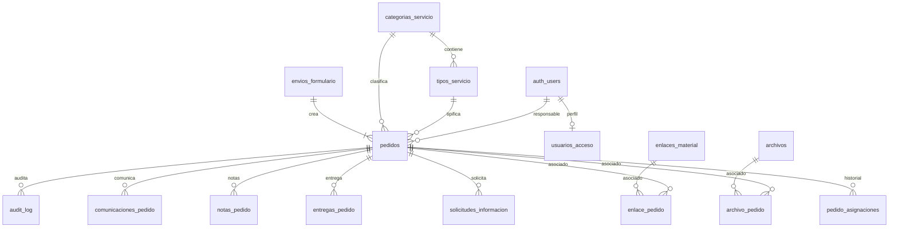

# PEDIDOS — Consolidado revisión 3.0

**Fecha:** 2026-09-11  
**Arquitectura:** `PEDIDOS-WSN-GD-v2`  
**Documentos incluidos:** `05_MODELO_DATOS_SUPABASE.md`, `06_AUTENTICACION_RBAC_RLS.md`, `07_RPC_EDGE_FUNCTIONS.md`, `08_STORAGE_ARCHIVOS.md`


---

# DOCUMENTO: 05_MODELO_DATOS_SUPABASE.md

# 05 — Modelo de datos Supabase

**Revisión documental:** 3.0 · 2026-09-11  
**Estado de implementación:** NO VERIFICADO; esta revisión documenta decisiones aprobadas, no ejecuta desarrollo.  
**Autoridad:** decisiones funcionales aprobadas por el propietario el 2026-09-11, ADR vigentes y requisitos de esta revisión.  
**Arquitectura:** `PEDIDOS-WSN-GD-v2` — WordPress.org + Supabase + n8n + Google Drive, con Supabase como fuente de verdad de negocio.  
**Repositorio oficial del desarrollo:** `https://github.com/drivegobtdf/formulariomedios`  
**Repositorio fuente de auditoría WeWeb:** `https://github.com/saldiviapablo/formulariopedidos`  
**Sustituye:** revisión documental 2.0 del 2026-09-11.  


## 1. Principios

- PostgreSQL es fuente de verdad.
- `envios_formulario` agrupa una presentación pública.
- `pedidos` es la unidad operativa; un PED = una pieza/servicio.
- No usar `servicios_solicitados` para nuevos datos v3.
- Secuencia global anual.
- JSONB solo para campos específicos validados por contrato/version.
- Archivos físicos fuera de PostgreSQL, en Google Drive.
- Relaciones de archivo N:M para compartir un único binario entre PED hermanos.
- Toda evolución mediante migrations.

## 2. ERD conceptual



## 3. `categorias_servicio`

| Campo | Tipo | Regla |
|---|---|---|
| id | uuid | PK |
| slug | text | UNIQUE |
| codigo_ped | char(1) | UNIQUE |
| nombre | text | NOT NULL |
| activo | boolean | default true |
| orden | integer | |

Seeds:
- `diseno_grafico` / D
- `cobertura_eventos` / C
- `gacetilla` / G
- `redes_sociales` / R
- `produccion_audiovisual` / P
- `motion_graphics` / M
- `streaming` / S
- `sitios_web` / W

## 4. `tipos_servicio`

Diseño:
- flyer_rrss;
- invitacion_digital;
- certificado;
- otros_diseno.

Resto:
- cobertura_eventos;
- gacetilla;
- redes_sociales;
- produccion_audiovisual;
- motion_graphics;
- streaming;
- sitios_web.

Las variantes internas de las nuevas categorías viven en `informacion_especifica` conforme al schema versionado, salvo futura normalización explícita.

## 5. `envios_formulario`

| Campo | Tipo | Regla |
|---|---|---|
| id | uuid | PK |
| submission_key | uuid | UNIQUE NOT NULL |
| request_fingerprint | text | NOT NULL |
| nombre_apellido | text | NOT NULL |
| telefono | text | NOT NULL |
| correo | text | NOT NULL |
| area_solicitante | text | NOT NULL |
| form_schema_version | integer | NOT NULL |
| created_at | timestamptz | default now() |

La clave/fingerprint gobierna la idempotencia de todo el conjunto.

## 6. `pedido_sequences`

| Campo | Tipo |
|---|---|
| anio | integer PK |
| current_value | bigint >= 0 |
| updated_at | timestamptz |

Reserva atómica global por año. El código de categoría no participa en la secuencia.

## 7. `pedidos`

| Campo | Tipo | Regla |
|---|---|---|
| id | uuid | PK |
| envio_id | uuid | FK envios_formulario NOT NULL |
| pedido_visible | text | UNIQUE NOT NULL |
| anio | integer | NOT NULL |
| numero | bigint | NOT NULL |
| categoria_id | uuid | FK NOT NULL |
| tipo_servicio_id | uuid | FK NOT NULL |
| codigo_categoria | char(1) | NOT NULL, snapshot contractual |
| estado | text | CHECK |
| responsable_user_id | uuid | FK auth.users nullable |
| informacion_especifica | jsonb | objeto validado |
| form_schema_version | integer | NOT NULL |
| fecha_limite | date | nullable, solo cuando el contrato la define |
| version | bigint | optimistic concurrency |
| tracking_token_version | bigint | NOT NULL |
| tracking_token_hash | text | UNIQUE NOT NULL |
| tracking_token_created_at | timestamptz | NOT NULL |
| cancelado_at | timestamptz | nullable |
| finalizado_at | timestamptz | nullable |
| archivado_at | timestamptz | nullable |
| archivado_por | uuid | nullable FK auth.users |
| created_at | timestamptz | |
| updated_at | timestamptz | |

Estados: Nuevo, En revisión, En proceso, Esperando información, Finalizado, Cancelado.

Unique adicional `(anio, numero)`.

## 8. `pedido_asignaciones`

| Campo | Tipo |
|---|---|
| id | uuid PK |
| pedido_id | uuid FK |
| responsable_anterior | uuid nullable |
| responsable_nuevo | uuid FK |
| asignado_por | uuid FK |
| motivo | text nullable |
| created_at | timestamptz |

No reemplaza `audit_log`; facilita consultas operativas.

## 9. `usuarios_acceso`

| Campo | Tipo |
|---|---|
| user_id | uuid PK/FK auth.users |
| nombre | text |
| apellido | text |
| nombre_usuario | text UNIQUE |
| estado_acceso | text CHECK |
| app_role | text CHECK |
| solicitado_at | timestamptz |
| aprobado_at | timestamptz nullable |
| aprobado_por | uuid nullable |
| rechazado_at | timestamptz nullable |
| rechazado_por | uuid nullable |
| revocado_at | timestamptz nullable |
| revocado_por | uuid nullable |
| motivo_revocacion | text nullable |
| updated_at | timestamptz |

Estados: pendiente, aprobado, rechazado, revocado.  
Roles: administrador, equipo, observador.

`nombre_usuario`: lowercase, trim, regex `^[a-z0-9._-]{2,30}$`.

## 10. `solicitudes_informacion`

- id uuid PK;
- pedido_id uuid FK;
- solicitada_por uuid;
- mensaje;
- token_hash UNIQUE;
- estado;
- expires_at;
- respuesta_texto;
- responded_at;
- created_at.

No necesita `servicio_id` en v3.

## 11. `archivos`

Metadata del binario Drive:

| Campo | Tipo |
|---|---|
| id | uuid PK |
| provider | text CHECK = google_drive |
| drive_file_id | text UNIQUE |
| drive_parent_id | text nullable |
| nombre_original | text |
| mime_type | text |
| size_bytes | bigint |
| sha256 | text nullable |
| contexto | text CHECK |
| estado | text CHECK |
| uploaded_by_user_id | uuid nullable |
| created_at | timestamptz |

Contextos: `solicitud`, `informacion_respuesta`, `interno`, `entrega`.  
Estados: `reserved`, `uploaded`, `verified`, `orphaned`, `deleted` según implementación aprobada.

## 12. `archivo_pedido`

PK compuesta `(archivo_id, pedido_id)`. Permite que un único `drive_file_id` se relacione con varios PED sin duplicar binario.

## 13. `upload_reservations`

- id;
- envio_id;
- archivo_id;
- expected_name;
- expected_size;
- expected_mime;
- drive_session_reference cifrada/temporal si corresponde;
- expires_at;
- completed_at;
- state.

Nunca persistir access/refresh tokens en esta tabla.

## 14. `enlaces_material`

- id uuid;
- envio_id;
- url;
- descripcion nullable;
- created_at.

`enlace_pedido` N:M asocia uno o más PED. Validar esquema HTTPS y longitud; no realizar fetch server-side automático de URLs no confiables.

## 15. `notas_pedido`

- id;
- pedido_id;
- autor_user_id;
- visibilidad: `interna` o `solicitante`;
- texto;
- created_at.

Las notas internas no llegan al DTO público.

## 16. `entregas_pedido`

- id;
- pedido_id;
- version;
- nota_publica nullable;
- url_entrega nullable;
- created_by;
- created_at;
- is_current.

Los archivos de entrega se asocian mediante relación específica o referencia de archivo. Debe existir archivo o URL. Una nueva entrega no borra la anterior.

## 17. `comunicaciones_pedido`

Una fila por entrega a destinatario/canal:
- delivery_id;
- event_id;
- pedido_id nullable para `submission.created`;
- envio_id nullable/obligatorio según evento;
- tipo;
- destinatario_canonico;
- template_version;
- estado;
- attempts;
- provider_message_id;
- claim_id/lease;
- idempotency key;
- timestamps.

## 18. `domain_events`

Eventos durables:
- `submission.created`;
- `pedido.state_changed`;
- `pedido.info_requested`;
- `pedido.info_responded`;
- `pedido.finalized`;
- `pedido.cancelled`;
- `pedido.assigned`;
- `pedido.archived`;
- `pedido.restored`;
- `tracking.recovery_requested`;
- `access.requested`.

## 19. `audit_log`

Append-only lógico:
- actor;
- action;
- entity;
- pedido_id/envio_id;
- old_values/new_values sanitizados;
- request_id;
- created_at.

Nunca passwords, tokens raw, OAuth credentials ni cuerpos completos sensibles.

## 20. Idempotencia y concurrencia

- `submission_key` único en envío;
- `request_fingerprint` detecta uso conflictivo;
- creación N PED en transacción;
- secuencia bloqueada/atómica;
- `version` para mutaciones;
- assignment/state/finalize/archive con precondiciones server-side.

## 21. Migración

No crear `servicios_solicitados` para datos v3. Si existen datos históricos de revisión 2.0, su transformación queda en `OPEN-013`; no ejecutar flatten destructivo sin plan de identidad y seguimiento.


---

# DOCUMENTO: 06_AUTENTICACION_RBAC_RLS.md

# 06 — Autenticación, RBAC y RLS

**Revisión documental:** 3.0 · 2026-09-11  
**Estado de implementación:** NO VERIFICADO; esta revisión documenta decisiones aprobadas, no ejecuta desarrollo.  
**Autoridad:** decisiones funcionales aprobadas por el propietario el 2026-09-11, ADR vigentes y requisitos de esta revisión.  
**Arquitectura:** `PEDIDOS-WSN-GD-v2` — WordPress.org + Supabase + n8n + Google Drive, con Supabase como fuente de verdad de negocio.  
**Repositorio oficial del desarrollo:** `https://github.com/drivegobtdf/formulariomedios`  
**Repositorio fuente de auditoría WeWeb:** `https://github.com/saldiviapablo/formulariopedidos`  
**Sustituye:** revisión documental 2.0 del 2026-09-11.  


## 1. Modelo

Supabase Auth gestiona identidad. `usuarios_acceso` gestiona aprobación y rol de aplicación. WordPress no participa en la autorización del dominio PEDIDOS.

## 2. Identidad

Login:
- email;
- contraseña.

Identidad operativa:
- `nombre_usuario` único;
- se muestra en asignaciones, tablero, detalle e historial.

Nombre y apellido identifican a la persona. Email no se usa como nombre visible de asignación.

## 3. Alta

Dos caminos:

### Solicitud libre
1. nombre;
2. apellido;
3. `nombre_usuario`;
4. email;
5. contraseña;
6. estado `pendiente`;
7. Administrador aprueba/rechaza y asigna rol.

### Invitación
Administrador ingresa email y rol; Supabase Auth envía invitación. La implementación deberá definir en staging si la cuenta invitada queda `aprobado` inmediatamente por ser una invitación administrativa o si requiere confirmación final; la intención funcional es que la invitación del Administrador no obligue a una segunda aprobación redundante.

## 4. Estados de acceso

- `pendiente`;
- `aprobado`;
- `rechazado`;
- `revocado`.

Solo `aprobado` habilita operación.

## 5. Roles

### `administrador`
- todas las operaciones de Equipo;
- aprobar/rechazar;
- invitar;
- cambiar roles;
- cambiar `nombre_usuario`;
- revocar.

### `equipo`
- leer pedidos;
- asignar/reasignar;
- cambiar estados;
- notas;
- info faltante;
- archivos/entrega;
- finalizar/cancelar;
- archivar/restaurar.

### `observador`
- lectura de información de pedidos;
- sin mutaciones;
- sin administración de usuarios.

## 6. Matriz

| Recurso/acción | anon | pendiente/rechazado/revocado | observador | equipo | administrador |
|---|---:|---:|---:|---:|---:|
| Crear envío público | vía Edge | vía Edge | vía Edge | vía Edge | vía Edge |
| Tracking público | token | token | token/JWT | token/JWT | token/JWT |
| Leer pedidos internos | No | No | Sí | Sí | Sí |
| Asignar/reasignar | No | No | No | Sí | Sí |
| Cambiar estado | No | No | No | Sí | Sí |
| Solicitar información | No | No | No | Sí | Sí |
| Finalizar/cancelar | No | No | No | Sí | Sí |
| Archivar/restaurar | No | No | No | Sí | Sí |
| Gestionar usuarios | No | No | No | No | Sí |

## 7. RLS y grants

- `anon` no tendrá SELECT directo a tablas de PED/PII.
- `authenticated` no basta: toda policy interna verifica `estado_acceso='aprobado'`.
- `observador` recibe SELECT limitado a recursos operativos permitidos.
- mutaciones críticas se realizan por RPC/Edge; no mediante UPDATE genérico desde browser.
- `service_role`/secret key nunca llegan al frontend.

## 8. Revocación

Una cuenta revocada debe quedar bloqueada aunque conserve un JWT todavía vigente. Las RPC/policies consultan `usuarios_acceso` en cada operación relevante.

## 9. `nombre_usuario`

- unique;
- lowercase;
- trim;
- `^[a-z0-9._-]{2,30}$`;
- el usuario no lo cambia libremente tras aprobación;
- solo Administrador puede cambiarlo;
- cambio auditado;
- asignaciones históricas conservan actor UUID y snapshots/joins para poder mostrar correctamente la trazabilidad.

## 10. Recuperación de contraseña

Supabase Auth. No almacenar contraseña en tablas propias. Mensajes de recuperación no deben revelar existencia de otras cuentas más allá de lo necesario.

## 11. Seguridad UI

Ocultar botones por rol mejora UX pero no constituye autorización. El Observador no deberá recibir/mostrar controles de mutación.

## 12. Primer/último Administrador

Bootstrap del primer administrador y protección contra eliminar/revocar al último Administrador quedan en `OPEN-015`. Ninguna implementación debe permitir un lockout administrativo accidental sin procedimiento documentado.

## 13. WordPress

Los nonces WordPress solo protegen acciones propias del plugin/settings. No reemplazan JWT, RLS, policies ni permisos Supabase.


---

# DOCUMENTO: 07_RPC_EDGE_FUNCTIONS.md

# 07 — RPC y Edge Functions

**Revisión documental:** 3.0 · 2026-09-11  
**Estado de implementación:** NO VERIFICADO; esta revisión documenta decisiones aprobadas, no ejecuta desarrollo.  
**Autoridad:** decisiones funcionales aprobadas por el propietario el 2026-09-11, ADR vigentes y requisitos de esta revisión.  
**Arquitectura:** `PEDIDOS-WSN-GD-v2` — WordPress.org + Supabase + n8n + Google Drive, con Supabase como fuente de verdad de negocio.  
**Repositorio oficial del desarrollo:** `https://github.com/drivegobtdf/formulariomedios`  
**Repositorio fuente de auditoría WeWeb:** `https://github.com/saldiviapablo/formulariopedidos`  
**Sustituye:** revisión documental 2.0 del 2026-09-11.  


## 1. Criterio

Usar RPC para invariantes transaccionales y Edge Functions para fronteras públicas, OAuth/Drive, CORS, antiabuso y coordinación externa.

## 2. Operaciones principales

| Operación | Tipo | Actor |
|---|---|---|
| `submission_prepare` | Edge | público |
| `drive_upload_prepare` | Edge | público/interno |
| `drive_upload_complete` | Edge | público/interno |
| `submission_create` | Edge + RPC | público |
| `tracking_get` | Edge | público |
| `tracking_recover` | Edge | público |
| `info_token_validate` | Edge | público |
| `info_response_submit` | Edge + RPC | público |
| `pedido_assign` | RPC | equipo/admin |
| `pedido_change_state` | RPC | equipo/admin |
| `pedido_finalize` | RPC | equipo/admin |
| `pedido_cancel` | RPC | equipo/admin |
| `pedido_reopen` | RPC | equipo/admin |
| `pedido_archive` | RPC | equipo/admin |
| `pedido_restore` | RPC | equipo/admin |
| `info_request_create` | RPC/Edge | equipo/admin |
| `access_approve/reject/role/revoke` | RPC/Edge | admin |
| `drive_download` | Edge | público/interno |
| `automation_next_event/result` | Edge | n8n |

## 3. `submission_prepare`

Crea capacidad temporal ligada a:
- `submission_key`;
- límites de upload;
- contract version;
- antiabuso;
- origen permitido.

No crea PED.

## 4. `drive_upload_prepare`

Entrada:
- submission/session;
- nombre;
- MIME;
- bytes;
- contexto;
- referencias cliente de las piezas objetivo.

Valida:
- máximo 10 archivos en presentación pública;
- máximo 10 MB por archivo;
- tipo permitido por contrato;
- cantidad y contexto;
- capacidad vigente.

Crea reserva y, server-side, inicia sesión resumable de Drive cuando corresponda.

Nunca devuelve access token ni refresh token.

## 5. `drive_upload_complete`

Verifica que el archivo:
- corresponde a la reserva;
- existe en Drive;
- tiene tamaño/nombre/MIME esperados dentro de tolerancias definidas;
- no fue confirmado previamente con identidad diferente.

Marca metadata como verificada. La asociación definitiva a PED ocurre al confirmar el envío.

## 6. `submission_create`

Entrada simplificada:

```json
{
  "submission_key": "uuid",
  "request_fingerprint": "...",
  "contacto": {},
  "pedidos": [
    {
      "client_request_ref": "uuid",
      "categoria": "diseno_grafico",
      "tipo": "flyer_rrss",
      "informacion_especifica": {}
    }
  ],
  "archivos": [],
  "enlaces_material": []
}
```

Reglas:
1. canonicalizar/validar;
2. lock idempotencia;
3. mismo key + mismo fingerprint → devolver mismo resultado;
4. mismo key + distinta carga → 409;
5. reservar N números globales consecutivos/atómicos;
6. crear `envios_formulario`;
7. crear N `pedidos` con códigos;
8. crear tokens tracking;
9. asociar archivos/enlaces N:M;
10. audit;
11. `submission.created`;
12. commit;
13. devolver todos los PED.

## 7. `pedido_assign`

Precondiciones:
- actor equipo/admin aprobado;
- responsable destino aprobado y con rol que pueda trabajar PED (`equipo` o `administrador`);
- `expected_version`.

No asignar a Observador.

Registra `pedido_asignaciones` + audit y actualiza versión.

## 8. `pedido_change_state`

Valida matriz:

- Nuevo → En revisión: responsable obligatorio.
- Nuevo → Cancelado: motivo mediante operación de cancelación.
- En revisión → En proceso.
- En revisión → Esperando información.
- En revisión → Cancelado.
- En proceso → Esperando información.
- En proceso → Finalizado mediante finalize.
- En proceso → Cancelado.
- Esperando información → En revisión.
- Esperando información → En proceso.
- Esperando información → Cancelado.
- Cancelado → reapertura mediante operación específica.
- Finalizado: sin transición directa a Cancelado.

No usar endpoint genérico para saltar precondiciones de Finalizado/Cancelado/Reapertura.

## 9. `pedido_finalize`

Requiere:
- actor autorizado;
- responsable existente;
- archivo de entrega verificado y/o URL HTTPS válida;
- nota opcional;
- expected_version.

Crea `entregas_pedido`, marca actual, preserva versiones anteriores, cambia estado y emite evento.

## 10. `pedido_cancel`

Motivo obligatorio. Estado permitido según matriz. Audita y emite `pedido.cancelled`.

## 11. `pedido_reopen`

Solo desde Cancelado, motivo obligatorio. Resultado:
- En revisión si se conserva/asigna responsable válido;
- Nuevo si no hay responsable.

## 12. `pedido_archive` / `restore`

Solo Finalizado/Cancelado. Modifica campos de archivado, no `estado`.

## 13. Información faltante

`info_request_create`:
- PED;
- mensaje;
- vigencia 15 días;
- token hash;
- evento.
No cambia estado.

`info_response_submit`:
- token válido;
- texto/archivos/link;
- idempotencia;
- marca respondida;
- evento;
- no cambia estado.

## 14. Tracking

`tracking_get` recibe PED + secreto/capacidad segura. Devuelve DTO mínimo. Debe usar comparación segura de hash y respuestas neutras.

## 15. Drive download

Verifica acceso y asociación antes de solicitar el binario a Google Drive. Nunca usa permisos públicos `anyone`.

## 16. Admin

Aprobar/rechazar/cambiar rol/revocar/cambiar username requieren Admin aprobado, concurrencia y auditoría.

## 17. Errores

- 400 payload;
- 401 credencial/token;
- 403 permiso;
- 404/neutral para recursos públicos según threat model;
- 409 idempotencia/concurrencia;
- 410 token/capacidad vencida;
- 413 tamaño;
- 422 regla de negocio;
- 429 antiabuso;
- 5xx externo/interno sin filtrar secretos.

## 18. CORS

Allowlist exacta de origen WordPress por entorno. No `*` para endpoints con credenciales/capacidades.

## 19. Integración Drive

Según documentación oficial, el inicio de un resumable upload requiere OAuth; el URI de sesión obtenido se usa para transferir contenido y expira según Google. La implementación final se cierra con pruebas del browser/receptor en `OPEN-016`.

Referencias:
- https://developers.google.com/workspace/drive/api/guides/manage-uploads
- https://developers.google.com/identity/protocols/oauth2/web-server


---

# DOCUMENTO: 08_STORAGE_ARCHIVOS.md

# 08 — Google Drive y archivos

**Revisión documental:** 3.0 · 2026-09-11  
**Estado de implementación:** NO VERIFICADO; esta revisión documenta decisiones aprobadas, no ejecuta desarrollo.  
**Autoridad:** decisiones funcionales aprobadas por el propietario el 2026-09-11, ADR vigentes y requisitos de esta revisión.  
**Arquitectura:** `PEDIDOS-WSN-GD-v2` — WordPress.org + Supabase + n8n + Google Drive, con Supabase como fuente de verdad de negocio.  
**Repositorio oficial del desarrollo:** `https://github.com/drivegobtdf/formulariomedios`  
**Repositorio fuente de auditoría WeWeb:** `https://github.com/saldiviapablo/formulariopedidos`  
**Sustituye:** revisión documental 2.0 del 2026-09-11.  


## 1. Decisión

Google Drive reemplaza a Supabase Storage como almacenamiento físico principal de PEDIDOS v3.

Supabase conserva:
- metadata;
- asociaciones;
- reservas;
- permisos;
- auditoría;
- contratos.

Google Drive conserva:
- bytes del archivo.

## 2. Cuenta y carpeta

Usar una carpeta raíz dedicada a PEDIDOS en la cuenta Google autorizada. Preferencia: que la aplicación cree/registre esa raíz durante bootstrap para trabajar con el scope mínimo `drive.file`.

Estructura humana sugerida, sin convertir paths en identidad autoritativa:

```text
PEDIDOS/
└── 2026/
    └── PED-2026-D000101/
        ├── recibidos/
        ├── respuestas/
        └── entregas/
```

La fuente de verdad de asociación es PostgreSQL, no el nombre de carpeta.

## 3. Límite público

- 10 archivos máximo por presentación inicial.
- 10 MB máximo por archivo.
- material mayor: `Link al material (opcional)`.

Los formatos permitidos de revisión 2.0 siguen siendo baseline hasta resolver `OPEN-014`: PDF, PNG, JPG/JPEG, DOCX y ZIP. No añadir MP4/MOV u otros silenciosamente.

## 4. Asociación múltiple

Con N PED:
- un archivo puede ser general;
- o específico.

Tabla N:M evita duplicar físicamente un archivo general.

## 5. Upload

Preferencia:
1. frontend pide reserva;
2. Edge valida;
3. Edge inicia resumable upload con OAuth server-side;
4. browser transfiere a URI de sesión si el spike lo valida;
5. frontend confirma;
6. Edge verifica metadata Drive;
7. creación final asocia a PED.

Para archivos >5 MB Google recomienda resumable upload; para <=5 MB también puede utilizarse. La app puede estandarizar el mismo mecanismo.

## 6. OAuth

- OAuth 2.0 web-server flow;
- `access_type=offline`;
- refresh token solo en secreto server-side;
- client secret solo server-side;
- access tokens efímeros;
- scope mínimo viable; `drive.file` preferido;
- rotación/revocación ensayada.

No usar contraseña de Google.

## 7. Descarga

Ni ciudadano ni Observador/Equipo reciben una URL pública permanente de Drive por defecto.

Endpoint autorizado:
- valida PED/token/JWT;
- valida asociación;
- obtiene binario con Drive API;
- entrega con headers seguros y filename controlado.

La estrategia exacta de streaming/URL temporal queda en `OPEN-016` y se prueba con 10 MB, navegadores objetivo y límites Edge.

## 8. Archivos de entrega

Diferenciar `entrega` de `solicitud`. Una versión nueva no destruye la anterior; se marca cuál es actual.

## 9. Huérfanos

Reservas incompletas expiran. Un job controlado puede marcar/borrar huérfanos después de ventana definida. Nunca borrar archivos confirmados por simple ausencia temporal de referencia durante una transacción.

## 10. Validación

- tamaño client-side + server-side;
- MIME declarado y metadata real disponible;
- extensión permitida;
- nombre saneado solo para presentación;
- ID Drive como referencia;
- no confiar en path/nombre;
- ZIP se trata como contenido no confiable;
- no renderizar HTML/SVG activo en contexto privilegiado.

## 11. Links externos

Aceptar HTTPS. No hacer SSRF/fetch automático. Mostrar al personal como link externo con advertencia. Puede asociarse a todos o a un PED.

## 12. Borrado y retención

`OPEN-003`. Hasta tener política:
- archivar PED no borra archivos;
- no implementar purga automática de material confirmado;
- toda eliminación manual/administrativa futura requiere audit y permisos.

## 13. Cuota

La cuenta disponible posee almacenamiento contratado por el propietario, pero la aplicación no debe asumir capacidad infinita. Registrar métricas/alertas de cuota antes de producción.

## 14. Fuentes oficiales verificadas 2026-09-11

- Drive API upload: https://developers.google.com/workspace/drive/api/guides/manage-uploads
- OAuth web server: https://developers.google.com/identity/protocols/oauth2/web-server
- Drive scopes: https://developers.google.com/workspace/drive/api/guides/api-specific-auth
